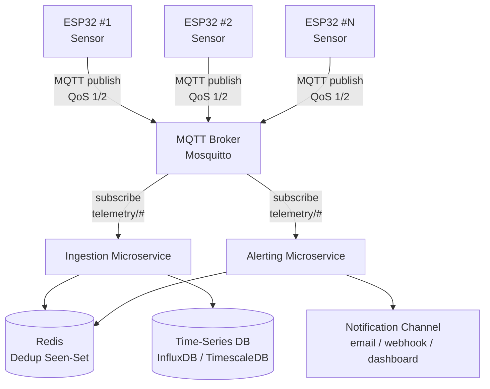
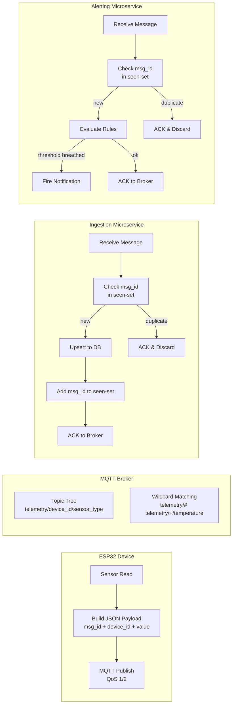
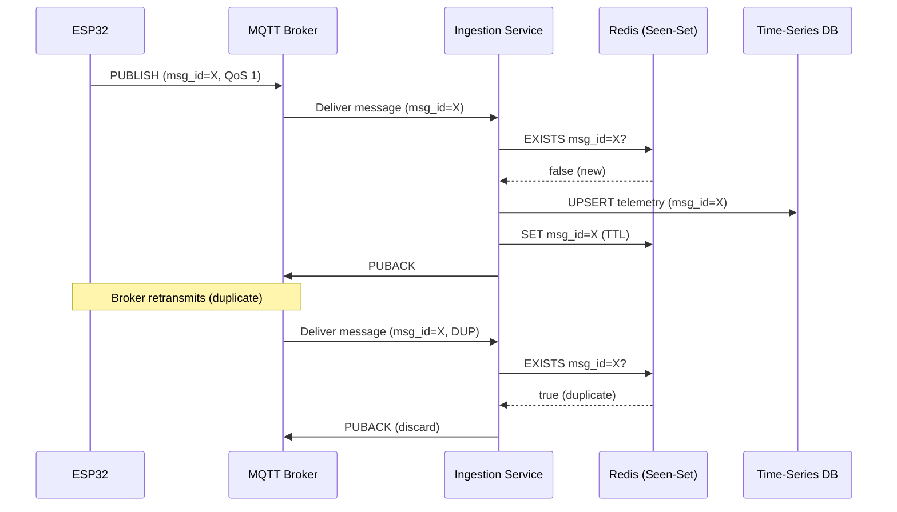
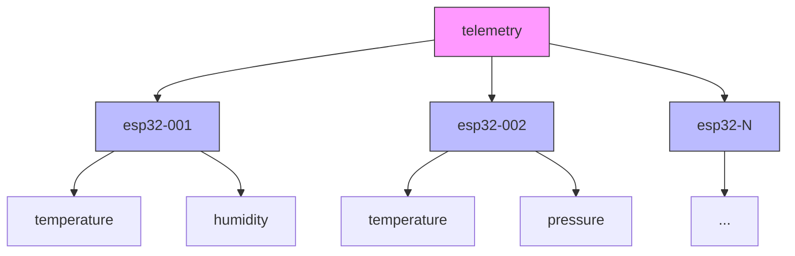

# System Architecture — Reliable IoT Telemetry Processing

## High-Level Architecture



## Component Detail



## Deduplication & Idempotency Flow



## MQTT Topic Hierarchy



| Subscription Pattern | Matches |
|---|---|
| `telemetry/#` | All telemetry from all devices and sensors |
| `telemetry/esp32-001/#` | All sensors on device esp32-001 |
| `telemetry/+/temperature` | Temperature readings from every device |

## Message Format (JSON)

```json
{
  "msg_id": "esp32-001-1713012345-a1b2",
  "device_id": "esp32-001",
  "sensor": "temperature",
  "value": 23.5,
  "unit": "°C",
  "timestamp": "2026-04-13T10:25:45Z"
}
```

| Field | Description |
|---|---|
| `msg_id` | Unique message identifier used for deduplication |
| `device_id` | Identifies the publishing ESP32 device |
| `sensor` | Sensor / measurement type |
| `value` | Numeric reading |
| `unit` | Unit of measurement |
| `timestamp` | ISO-8601 UTC timestamp of the reading |

## Components Summary

| Component | Role |
|---|---|
| **ESP32 Devices** | Publish sensor telemetry over MQTT with unique msg_id |
| **MQTT Broker (Mosquitto)** | Central pub/sub hub, QoS enforcement, topic routing |
| **Ingestion Microservice** | Deduplicate, validate, and persist telemetry to DB |
| **Alerting Microservice** | Evaluate threshold rules and fire notifications |
| **Time-Series DB** | Store and query telemetry data |
| **Redis** | Fast deduplication seen-set with TTL expiry |

## Testing Scenarios

| Category | Scenario | What to Measure |
|---|---|---|
| **Performance** | N devices at M msg/sec | End-to-end latency, sustained throughput |
| **QoS comparison** | QoS 0 vs 1 vs 2 under load | Message loss rate |
| **Duplicate handling** | Publish identical msg_id multiple times | Verify single storage |
| **Broker failure** | Kill and restart Mosquitto mid-stream | Data loss at QoS ≥ 1 |
| **Service crash** | Stop ingestion, let messages queue, restart | Catch-up completeness |
| **Network partition** | Simulate intermittent ESP32 connectivity | Reconnect and retry behaviour |
