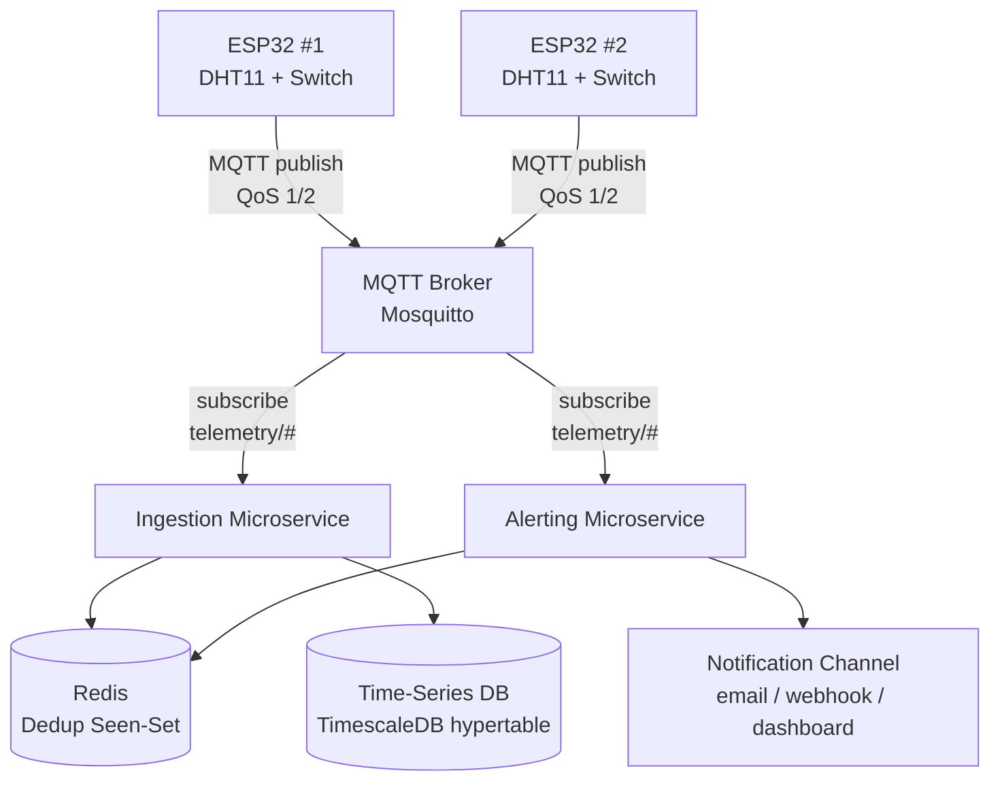
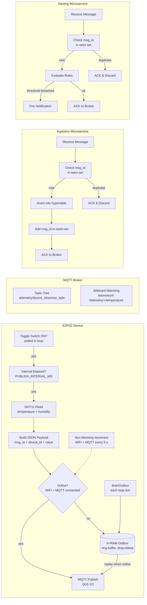
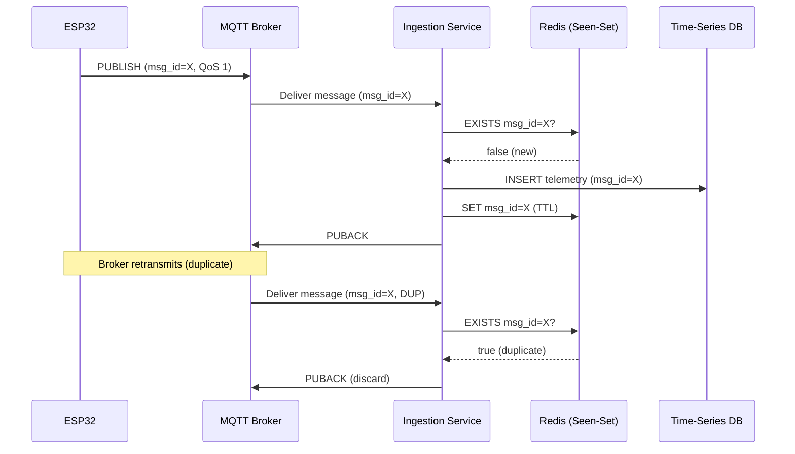
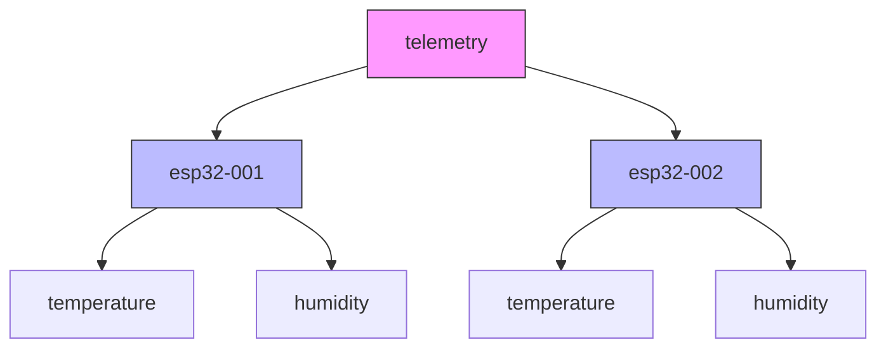

# System Architecture — Reliable IoT Telemetry Processing

## High-Level Architecture


```mermaid
graph TD
    ESP1[ESP32 #1<br>DHT11 + Switch] -->|MQTT publish<br>QoS 1/2| Broker[MQTT Broker<br>Mosquitto]
    ESP2[ESP32 #2<br>DHT11 + Switch] -->|MQTT publish<br>QoS 1/2| Broker

    Broker -->|subscribe<br>telemetry/#| Ingestion[Ingestion Microservice]
    Broker -->|subscribe<br>telemetry/#| Alerting[Alerting Microservice]

    Ingestion --> Redis[(Redis<br>Dedup Seen-Set)]
    Ingestion --> TSDB[(Time-Series DB<br>TimescaleDB hypertable)]

    Alerting --> Redis
    Alerting --> Notify[Notification Channel<br>email / webhook / dashboard]
```

## Component Detail


```mermaid
graph LR
    subgraph ESP32 Device
        Switch[Toggle Switch ON?<br>polled in loop] -->|yes| Interval[Interval Elapsed?<br>PUBLISH_INTERVAL_MS]
        Interval -->|yes| Sensor[DHT11 Read<br>temperature + humidity]
        Sensor --> Payload[Build JSON Payload<br>msg_id + device_id + value]
        Payload --> Online{Online?<br>WiFi + MQTT connected}
        Online -->|yes| Pub[MQTT Publish<br>QoS 1/2]
        Online -->|no| Outbox[(In-RAM Outbox<br>ring buffer, drop-oldest)]
        Drain[drainOutbox<br>each loop tick] --> Outbox
        Outbox -->|replay when online| Pub
        Recon[Non-blocking reconnect<br>WiFi + MQTT every 5 s] -.-> Online
    end

    subgraph MQTT Broker
        Topics[Topic Tree<br>telemetry/device_id/sensor_type]
        Wildcard[Wildcard Matching<br>telemetry/# telemetry/+/temperature]
    end

    subgraph Ingestion Microservice
        Recv1[Receive Message] --> Dedup[Check msg_id<br>in seen-set]
        Dedup -->|new| Store[Insert into hypertable]
        Dedup -->|duplicate| Discard1[ACK & Discard]
        Store --> AddSeen[Add msg_id to seen-set]
        AddSeen --> ACK1[ACK to Broker]
    end

    subgraph Alerting Microservice
        Recv2[Receive Message] --> Dedup2[Check msg_id<br>in seen-set]
        Dedup2 -->|new| Eval[Evaluate Rules]
        Dedup2 -->|duplicate| Discard2[ACK & Discard]
        Eval -->|threshold breached| Alert[Fire Notification]
        Eval -->|ok| ACK2[ACK to Broker]
    end
```

## Deduplication & Idempotency Flow


```mermaid
sequenceDiagram
    participant ESP as ESP32
    participant Broker as MQTT Broker
    participant Svc as Ingestion Service
    participant Redis as Redis (Seen-Set)
    participant DB as Time-Series DB

    ESP->>Broker: PUBLISH (msg_id=X, QoS 1)
    Broker->>Svc: Deliver message (msg_id=X)
    Svc->>Redis: EXISTS msg_id=X?
    Redis-->>Svc: false (new)
    Svc->>DB: INSERT telemetry (msg_id=X)
    Svc->>Redis: SET msg_id=X (TTL)
    Svc->>Broker: PUBACK

    Note over ESP,Broker: Broker retransmits (duplicate)

    Broker->>Svc: Deliver message (msg_id=X, DUP)
    Svc->>Redis: EXISTS msg_id=X?
    Redis-->>Svc: true (duplicate)
    Svc->>Broker: PUBACK (discard)
```

## MQTT Topic Hierarchy


```mermaid
graph TD
    Root[telemetry] --> D1[esp32-001]
    Root --> D2[esp32-002]

    D1 --> D1T[temperature]
    D1 --> D1H[humidity]
    D2 --> D2T[temperature]
    D2 --> D2H[humidity]

    style Root fill:#f9f,stroke:#333
    style D1 fill:#bbf,stroke:#333
    style D2 fill:#bbf,stroke:#333
```

| Subscription Pattern | Matches |
|---|---|
| `telemetry/#` | All telemetry from all devices and sensors |
| `telemetry/esp32-001/#` | All sensors on device esp32-001 |
| `telemetry/+/temperature` | Temperature readings from every device |

## Message Format (JSON)

```json
{
  "msg_id": "esp32-001-1713012345-a1b2",
  "device_id": "esp32-001",
  "sensor": "temperature",
  "value": 23.5,
  "unit": "°C",
  "timestamp": "2026-04-13T10:25:45Z"
}
```

| Field | Description |
|---|---|
| `msg_id` | Unique message identifier used for deduplication |
| `device_id` | Identifies the publishing ESP32 device |
| `sensor` | Sensor / measurement type |
| `value` | Numeric reading |
| `unit` | Unit of measurement |
| `timestamp` | ISO-8601 UTC timestamp of the reading |

## Components Summary

| Component | Role |
|---|---|
| **ESP32 Devices** | Two identical nodes (esp32-001/002). Each has a DHT11 sensor and a toggle switch on GPIO 27. While the switch is ON, the firmware publishes temperature + humidity readings over MQTT every `PUBLISH_INTERVAL_MS` (default 5 s) with a unique `msg_id`. When WiFi or the broker is unreachable, readings are queued in an in-RAM ring-buffer outbox (capacity `OUTBOX_CAPACITY`, drop-oldest) and replayed on reconnect — non-blocking reconnect attempts keep the sensor loop running throughout the outage |
| **MQTT Broker (Mosquitto)** | Central pub/sub hub, QoS enforcement, topic routing |
| **Ingestion Microservice** | Deduplicate, validate, and persist telemetry to DB |
| **Alerting Microservice** | Evaluate threshold rules and fire notifications |
| **Time-Series DB (TimescaleDB)** | Postgres extension providing hypertables — `telemetry_readings` is partitioned on `received_at`, `alert_events` on `created_at`. Schema is managed via Flyway migrations (`V1__init_timescale.sql`) in each service. Because hypertables cannot enforce a UNIQUE constraint that omits the partitioning column, `msg_id` is **not** a primary key — deduplication is delegated entirely to Redis. |
| **Redis** | Fast deduplication seen-set with TTL expiry |

## Testing Scenarios

| Category | Scenario | What to Measure |
|---|---|---|
| **Performance** | N devices at M msg/sec | End-to-end latency, sustained throughput |
| **QoS comparison** | QoS 0 vs 1 vs 2 under load | Message loss rate |
| **Duplicate handling** | Publish identical msg_id multiple times | Verify single storage |
| **Broker failure** | Kill and restart Mosquitto mid-stream | Data loss at QoS ≥ 1 |
| **Service crash** | Stop ingestion, let messages queue, restart | Catch-up completeness |
| **Network partition** | Simulate intermittent ESP32 connectivity | Reconnect and retry behaviour; outbox queue depth vs. zero data loss up to capacity |
